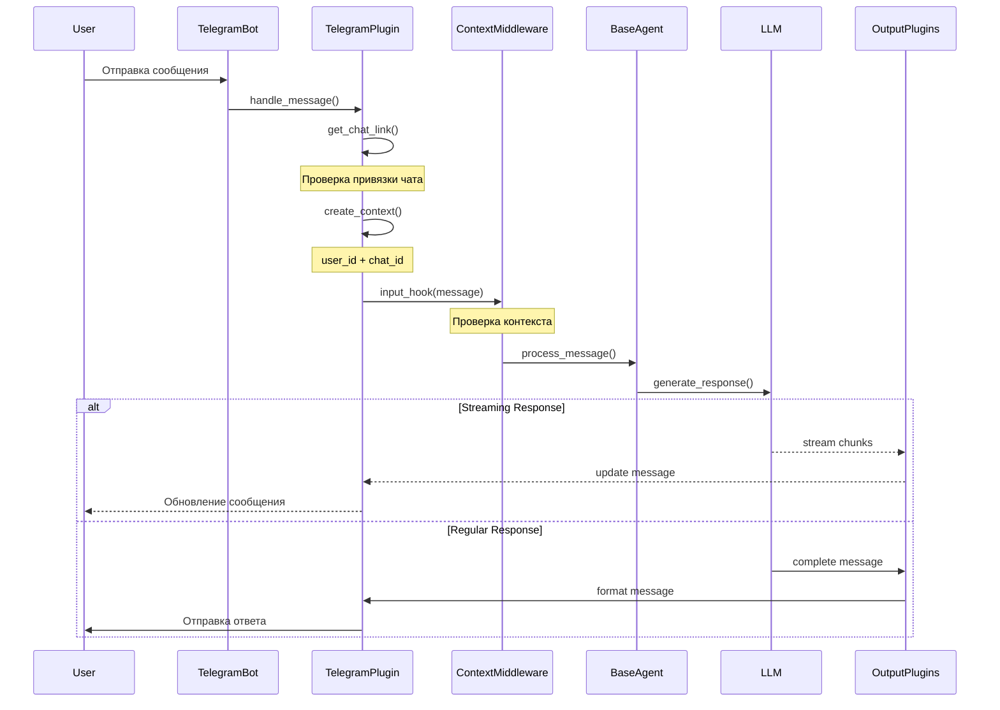
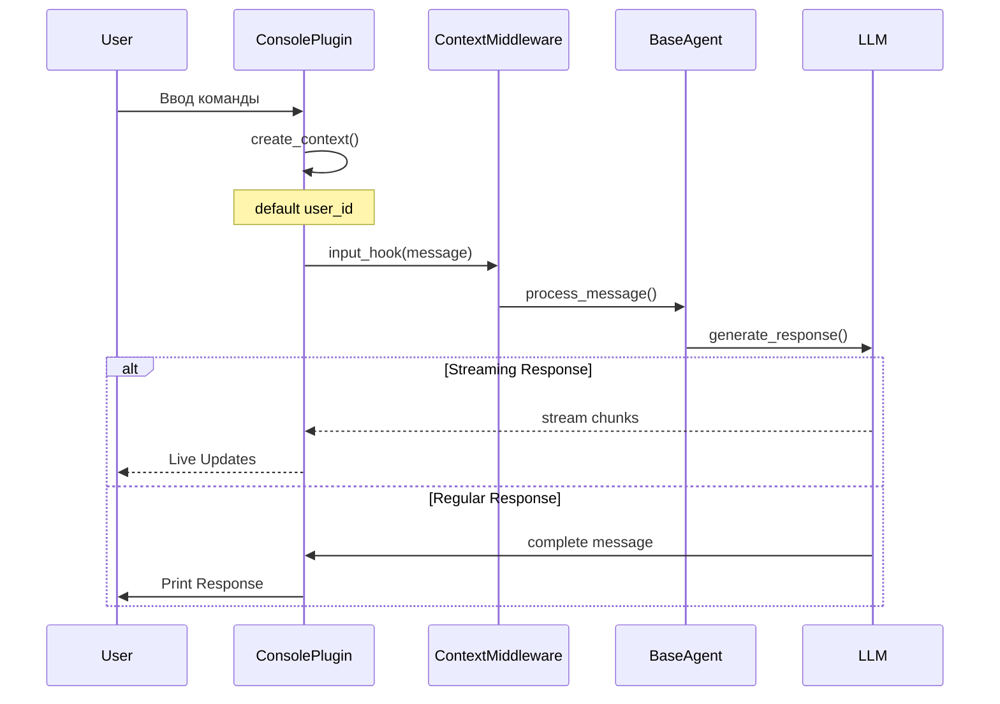
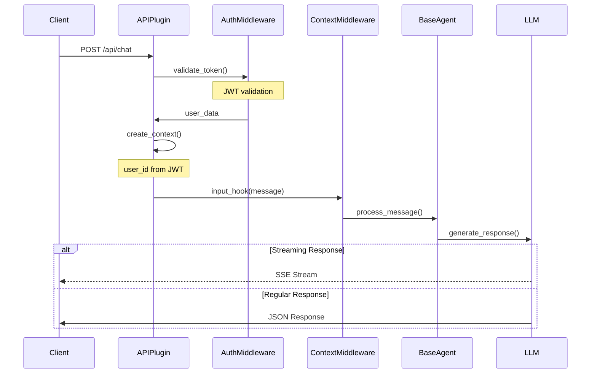
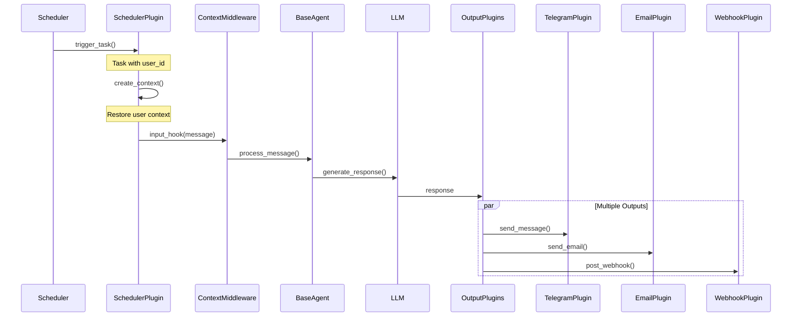
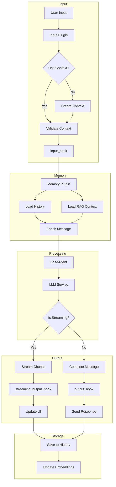
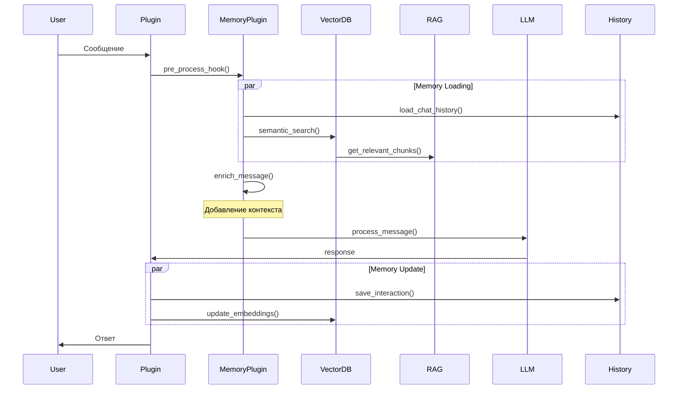
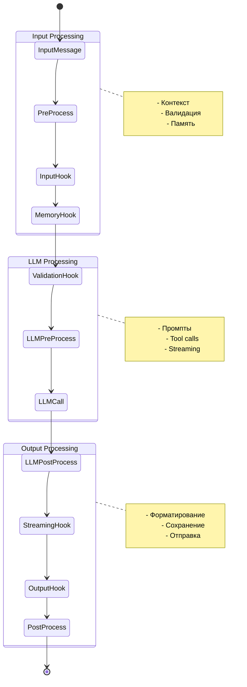
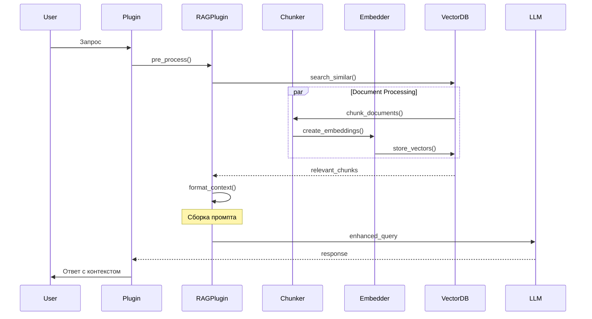

# Архитектура CogniStruct

## Основные компоненты

### 1. Система сообщений (`messages.py`)
Ядро коммуникации между компонентами системы - класс `IOMessage`:

```python
class IOMessage:
    type: str           # Тип сообщения
    content: Any        # Содержимое
    metadata: Dict      # Метаданные
    source: str         # Источник
    stream: Generator   # Стрим для асинхронных данных
    is_async: bool      # Флаг асинхронности
    tool_calls: List    # История инструментов
    context: RequestContext  # Контекст запроса
```

### 2. Система контекста (`context.py`)
Управление контекстом запросов в многопользовательской среде:

```python
@dataclass
class RequestContext:
    user_id: str        # ID пользователя
    chat_id: str        # ID чата (опционально)
    metadata: Dict      # Дополнительные данные
    timestamp: float    # Время создания
```

Ключевые особенности:
- Инкапсуляция пользовательского контекста
- Автоматическое распространение через цепочку плагинов
- Поддержка метаданных специфичных для платформы

### 3. Базовый плагин (`base_plugin.py`)
Абстрактный класс для всех плагинов системы:

```python
class BasePlugin:
    async def input_hook(message: IOMessage) -> bool
    async def output_hook(message: IOMessage) -> Optional[IOMessage]
    async def streaming_output_hook(message: IOMessage) -> AsyncGenerator[IOMessage]
```

### 4. Middleware система
Промежуточные обработчики для кросс-плагинной функциональности:

```python
class ContextMiddleware(BasePlugin):
    async def input_hook(message: IOMessage) -> bool:
        # Проверка наличия контекста
        if not message.context:
            return True  # Блокируем сообщения без контекста
```

## Поток данных

1. **Входящее сообщение**:
   ```
   User Input -> Plugin (создание контекста) -> IOMessage -> Middleware -> LLM
   ```

2. **Обработка ответа**:
   ```
   LLM Response -> IOMessage (с контекстом) -> Plugins -> User
   ```

3. **Стриминг**:
   ```
   LLM Stream -> Chunks (копирование контекста) -> Plugins -> Real-time Updates
   ```

## Управление контекстом

### 1. Создание контекста
- **Ответственность плагинов**:
  ```python
  # В Telegram плагине
  chat_link = await db.get_chat_link(chat_id)
  context = RequestContext(
      user_id=chat_link["user_id"],
      chat_id=chat_id,
      metadata={"platform": "telegram"}
  )
  message.context = context
  ```

### 2. Проверка контекста
- **Middleware**:
  ```python
  # В ContextMiddleware
  if not message.context:
      logger.warning("No context in message")
      return True  # Блокируем обработку
  ```

### 3. Распространение контекста
- **В стримах**:
  ```python
  async for chunk in message.stream:
      chunk.context = original_context
      yield chunk
  ```

## Рекомендации по реализации

1. **Плагины**:
   - Создавать контекст до отправки сообщения в цепочку
   - Использовать свои механизмы аутентификации
   - Добавлять платформо-специфичные метаданные

2. **Middleware**:
   - Проверять наличие обязательных полей контекста
   - Логировать проблемы с контекстом
   - Обеспечивать копирование контекста в стримах

3. **LLM интеграция**:
   - Передавать контекст через метаданные
   - Использовать user_id для разделения истории
   - Учитывать контекст при генерации ответов

## Примеры использования

### 1. Telegram интеграция
```python
# В обработчике сообщений
chat_link = await db.get_chat_link(chat_id)
context = RequestContext(user_id=chat_link["user_id"])
message = IOMessage(content=text).with_context(context)
```

### 2. Доступ к контексту
```python
# В любом плагине
if message.context:
    user_id = message.context.user_id
    platform_data = message.context.metadata
```

### 3. Стриминг с контекстом
```python
# В streaming_output_hook
async for chunk in message.stream:
    chunk.context = message.context
    # Обработка чанка
```

## Безопасность

1. **Изоляция пользователей**:
   - Проверка контекста в middleware
   - Валидация user_id
   - Логирование подозрительной активности

2. **Защита данных**:
   - Минимизация данных в контексте
   - Очистка чувствительной информации
   - Контроль доступа к метаданным

## Будущие улучшения

1. **Производительность**:
   - Кэширование контекста
   - Оптимизация копирования
   - Ленивая загрузка метаданных

2. **Расширяемость**:
   - Поддержка вложенных контекстов
   - Система событий контекста
   - Плагины для работы с контекстом

3. **Надежность**:
   - Восстановление контекста
   - Валидация целостности
   - Отказоустойчивость

## Диаграммы потоков

### Telegram Plugin Flow


### Console Plugin Flow


### REST API Flow


### Scheduler Plugin Flow


### Message Lifecycle Flow


### Memory Integration Flow


### Hook Execution Flow


### RAG Integration Flow


## Жизненный цикл сообщения

### 1. Входная обработка
- Создание/валидация контекста
- Загрузка истории чата
- Поиск релевантного контекста (RAG)
- Обогащение сообщения метаданными

### 2. Обработка LLM
- Подготовка промпта
- Вызов инструментов
- Стриминг ответа
- Обработка ошибок

### 3. Выходная обработка
- Форматирование ответа
- Сохранение в историю
- Обновление эмбеддингов
- Отправка пользователю

## Интеграция с памятью

### 1. Типы памяти
- Краткосрочная (текущая сессия)
- Долгосрочная (векторная БД)
- Семантическая (RAG)
- Эпизодическая (история чата)

### 2. Механизмы обновления
- Автоматическое сохранение диалогов
- Периодическое обновление эмбеддингов
- Прунинг устаревших данных
- Индексация новых документов

### 3. Контекстное обогащение
- Релевантные чанки документов
- История взаимодействий
- Пользовательские предпочтения
- Системные метаданные

## Проблемные точки

1. **Контекст в стримах**:
   - Каждый чанк копирует весь контекст
   - Возможна оптимизация через ссылки

2. **Множественные выходы**:
   - Планировщик может отправлять в несколько каналов
   - Нужна синхронизация контекста между каналами

3. **Восстановление контекста**:
   - При перезапуске планировщика
   - При повторных попытках отправки

4. **Валидация контекста**:
   - Разные плагины требуют разные поля
   - Нужна гибкая система валидации

## Предложения по улучшению

1. **Оптимизация памяти**:
   ```python
   class StreamContext:
       """Легковесный контекст для стримов"""
       __slots__ = ['user_id', 'chat_id']
   ```

2. **Система событий**:
   ```python
   @context_event('user_authenticated')
   async def handle_auth(context: RequestContext):
       # Дополнительная обработка после аутентификации
   ```

3. **Валидация контекста**:
   ```python
   class TelegramContext(RequestContext):
       chat_id: str  # Обязательное поле для Telegram
       platform: str = 'telegram'  # Автоматически
   ```

[остальной контент остается без изменений...] 